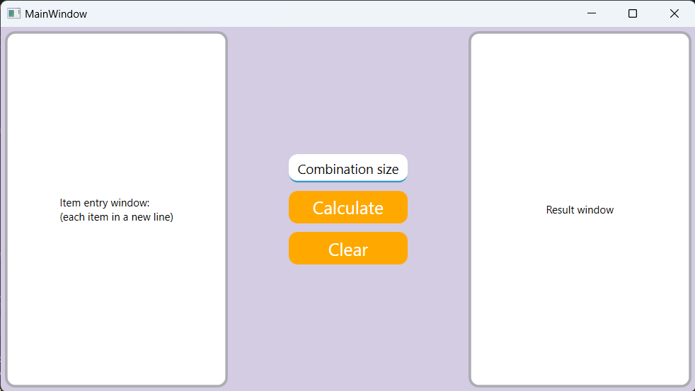
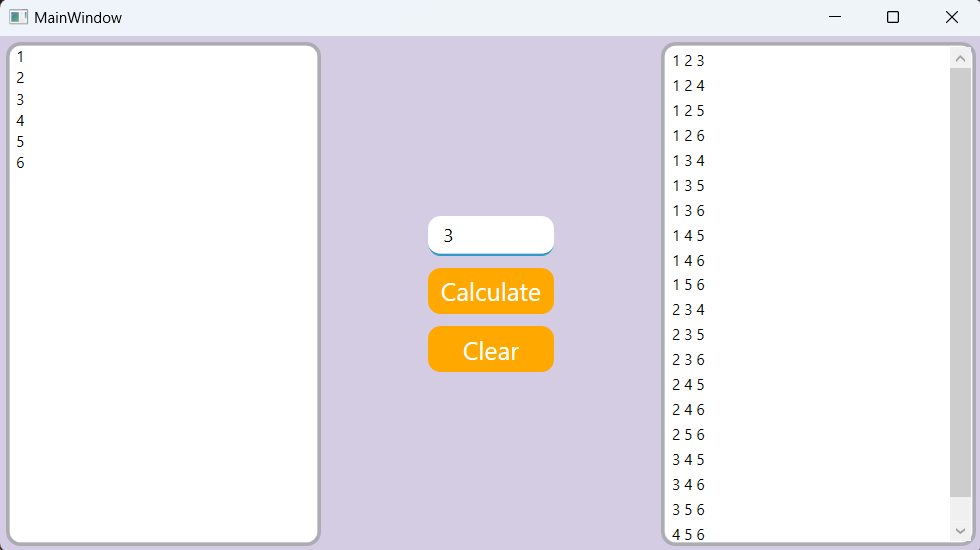

# GeneratorOfCombinations

GeneratorOfCombinations is a simple С# WPF application that generates combinations of elements from given input list.

## Screenshots

### App Startup


### Sample Output


## How to Use

1. Clone the repository:

```bash
git clone https://github.com/VelSkorp/GeneratorOfCombinations.git
```

2. Navigate to the project directory:

```bash
cd GeneratorOfCombinations
```

3. Build the application:

```bash
dotnet build GeneratorOfCombinations.sln
```

4. Run the application:

```bash
dotnet run GeneratorOfCombinations.sln
```

5. Follow the prompts to specify the size of combinations and input set.

6. View the generated combinations in the right side output.

## Contributing

Contributions are welcome! If you find any issues or have suggestions for improvements, please open an issue or create a pull request on GitHub.

## License

This project is licensed under the MIT License.